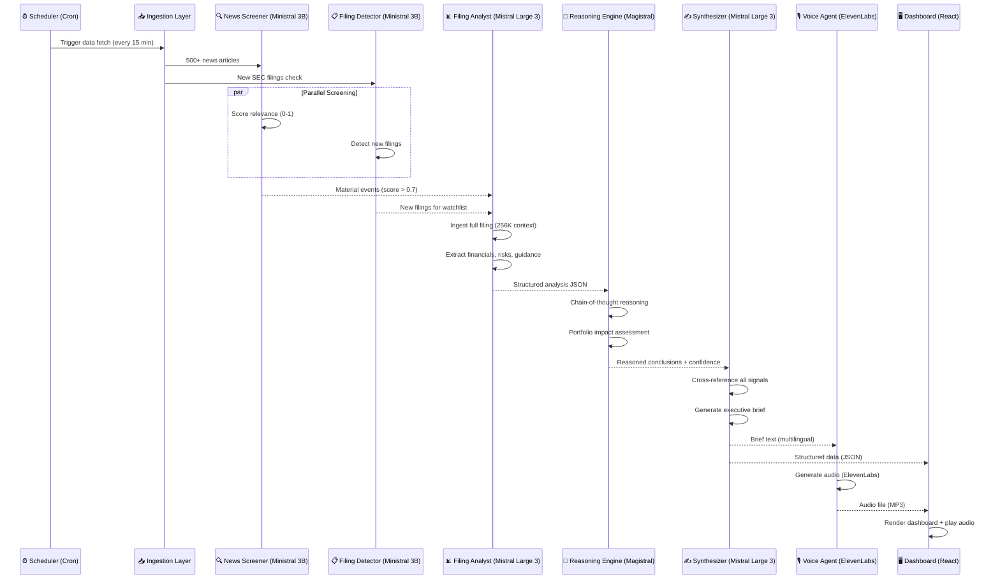

<p align="center">
  
</p>

<h1 align="center">📊 QuantBrief — AI-Powered Real-Time Market Intelligence Agent</h1>

<p align="center">
  <strong>Bloomberg Terminal intelligence at zero cost — powered by the full Mistral model ecosystem</strong>
</p>

<p align="center">
  <a href="#demo">View Demo</a> •
  <a href="#architecture">Architecture</a> •
  <a href="#quickstart">Quick Start</a> •
  <a href="#features">Features</a> •
  <a href="#tech-stack">Tech Stack</a>
</p>

<p align="center">
  
  
  
  
  
  
</p>

<p align="center">
  🏆 Built for the <strong>Mistral AI Worldwide Hackathon 2026</strong> — Feb 28 – Mar 1
  <br/>
  Track: <strong>Anything Goes</strong> | Team: <strong>Kacper Saks</strong>
</p>

---

## 🎯 The Problem

> **Every morning, 150+ million retail investors worldwide wake up to information chaos.**

A Bloomberg Terminal costs **$25,200/year**. Without it, retail investors and independent analysts face:

| Pain Point | Impact |
|---|---|
| **Information Overload** | 300+ financial news articles published per hour across major outlets |
| **Delayed Reaction** | By the time you read an earnings report, algorithms have already moved the market |
| **Language Barriers** | SEC filings are written in legal/financial jargon. European investors additionally face English-only sources |
| **No Synthesis** | You can find data everywhere — but nobody connects the dots across SEC filings, news, and technicals |
| **Analysis Paralysis** | Retail investors spend ~4.2 hours/week reading financial content but make worse decisions than index funds |

The information asymmetry between Wall Street and Main Street is **the #1 structural disadvantage** that retail investors face. It's not about speed — it's about **synthesis and context**.

---

## 💡 The Solution

**QuantBrief** is a multi-agent AI system that acts as your **personal Chief Investment Officer**. It continuously monitors markets, SEC filings, and news — then delivers an actionable, synthesized intelligence brief every morning.

Think of it as: **Bloomberg Terminal** meets **Morning Brew** meets **AI Analyst** — for free.

### What QuantBrief Does

```
🌅 6:00 AM — You wake up. QuantBrief has already:

  ✅ Scanned 500+ overnight news articles using Ministral 3 (fast screening)
  ✅ Detected 3 material events affecting your watchlist
  ✅ Pulled the full 10-K filing for $NVDA (loaded into Mistral Large 3's 256K context)
  ✅ Extracted 12 key financial metrics and compared to analyst expectations
  ✅ Used Magistral reasoning to assess portfolio impact
  ✅ Generated a 3-minute audio briefing via ElevenLabs
  ✅ Prepared a visual dashboard with charts and action items

🎧 6:05 AM — You listen to your personalized brief while commuting.
📊 6:20 AM — You open the dashboard for deep-dives on anything interesting.
✅ 6:30 AM — You're better informed than 99% of retail investors.
```

---

<a id="demo"></a>
## 🎬 Demo

> 📹 **[Watch the Full Demo Video (3 min)](https://youtu.be/PLACEHOLDER)**

### Screenshots

<p align="center">
  
  <br/>
  <em>Main Dashboard — overnight events, portfolio impact, market sentiment</em>
</p>

<p align="center">
  
  <br/>
  <em>SEC Filing Deep Dive — Mistral Large 3 analyzing full 10-K in 256K context</em>
</p>

<p align="center">
  
  <br/>
  <em>ElevenLabs Audio Briefing — listen to your market intel on the go</em>
</p>

---

<a id="features"></a>
## ✨ Features

### 🔍 Multi-Source Intelligence Aggregation
- **SEC EDGAR Integration** — Real-time monitoring of 10-K, 10-Q, 8-K filings via the free EDGAR API (no auth required)
- **Financial News Scanning** — RSS feeds from Reuters, Bloomberg summaries, MarketWatch, FT, WSJ
- **Market Data** — Real-time & historical OHLCV via Alpha Vantage + Finnhub (free tiers)
- **Earnings Calendar** — Automated tracking of earnings dates and consensus estimates
- **Macro Data** — FRED economic indicators (GDP, CPI, unemployment, Fed funds rate)

### 🤖 Multi-Agent AI Pipeline (Mistral Ecosystem)

| Agent | Model | Role | Why This Model |
|---|---|---|---|
| **News Screener** | `ministral-3b-latest` | High-throughput first-pass filtering of 500+ articles | Ultra-fast, low-cost, edge-deployable. Screens in <50ms/article |
| **Filing Analyst** | `mistral-large-latest` | Deep analysis of SEC filings using full 256K context | Only model that can ingest an entire 10-K (80-120 pages) in a single pass |
| **Reasoning Engine** | `magistral-medium-latest` | Chain-of-thought portfolio impact assessment | Explicit reasoning chains with confidence scores |
| **Signal Synthesizer** | `mistral-large-latest` | Cross-source correlation and actionable brief generation | Connects dots across news, filings, and market data |
| **Briefing Narrator** | ElevenLabs API | Text-to-speech for audio morning brief | Professional voice quality, multilingual support |

### 📊 Quantitative Analytics
- **Financial Ratio Calculator** — Automatic P/E, P/B, D/E, ROE, ROIC, FCF Yield extraction
- **Earnings Surprise Detection** — Compares reported vs. consensus with statistical significance
- **Sentiment Scoring** — NLP-powered sentiment analysis on news with ticker-level granularity
- **Technical Signals** — RSI, MACD, Bollinger Bands crossover detection via Alpha Vantage indicators API
- **Sector Rotation Tracker** — Cross-sector momentum analysis

### 🌍 Multilingual Support (Mistral's Superpower)
- Dashboard UI in **EN / FR / DE / PL / ES**
- Audio briefings generated in user's preferred language
- Automatic translation of key findings from English-only SEC filings
- Leverages Mistral Large 3's native 40+ language support

### 🎧 Audio Intelligence (ElevenLabs Integration)
- **Morning Brief** — 3-5 minute personalized audio summary
- **Flash Alerts** — Real-time spoken alerts for material events
- **Deep Dive Narration** — Listen to full filing analysis hands-free
- Multiple voice options and speaking speed control
- Multilingual voice generation

---

<a id="architecture"></a>
## 🏗️ System Architecture

```
┌──────────────────────────────────────────────────────────────────────┐
│                         DATA SOURCES (Free APIs)                     │
├──────────┬──────────┬──────────┬──────────┬──────────┬──────────────┤
│SEC EDGAR │  Alpha   │  Finnhub │  RSS/    │  FRED    │  Earnings    │
│ (Filings)│ Vantage  │  (RT)    │  News    │  (Macro) │  Calendar    │
│ FREE     │ FREE     │  FREE    │  FREE    │  FREE    │  FREE        │
└────┬─────┴────┬─────┴────┬─────┴────┬─────┴────┬─────┴──────┬───────┘
     │          │          │          │          │            │
     ▼          ▼          ▼          ▼          ▼            ▼
┌──────────────────────────────────────────────────────────────────────┐
│                     INGESTION LAYER (Python AsyncIO)                  │
│  ┌──────────┐ ┌──────────┐ ┌──────────┐ ┌──────────┐ ┌──────────┐  │
│  │ Filing   │ │ Price    │ │ News     │ │ Macro    │ │ Earnings │  │
│  │ Fetcher  │ │ Fetcher  │ │ Fetcher  │ │ Fetcher  │ │ Fetcher  │  │
│  └────┬─────┘ └────┬─────┘ └────┬─────┘ └────┬─────┘ └────┬─────┘  │
│       └─────────────┴────────────┴─────────────┴────────────┘        │
│                              │                                       │
│                     ┌────────▼────────┐                              │
│                     │  Data Normalizer │                              │
│                     │  & Cache (Redis) │                              │
│                     └────────┬────────┘                              │
└──────────────────────────────┼───────────────────────────────────────┘
                               │
     ┌─────────────────────────▼──────────────────────────┐
     │            MULTI-AGENT ORCHESTRATOR                 │
     │           (Mistral Agents API + Custom)             │
     │                                                     │
     │  ┌───────────────────────────────────────────────┐  │
     │  │  STAGE 1: SCREENING (Parallel)                │  │
     │  │  ┌─────────────┐  ┌─────────────────────────┐ │  │
     │  │  │ News Agent  │  │ Filing Detection Agent  │ │  │
     │  │  │ Ministral   │  │ Ministral 3B            │ │  │
     │  │  │ 3B          │  │                         │ │  │
     │  │  │ ~50ms/item  │  │ New filing? → Flag      │ │  │
     │  │  └──────┬──────┘  └───────────┬─────────────┘ │  │
     │  │         └──────────┬──────────┘               │  │
     │  │                    ▼                          │  │
     │  │         ┌──────────────────┐                  │  │
     │  │         │ Priority Queue   │                  │  │
     │  │         │ (Material Events │                  │  │
     │  │         │  Score > 0.7)    │                  │  │
     │  │         └────────┬─────────┘                  │  │
     │  └─────────────────┼────────────────────────────┘  │
     │                    ▼                                │
     │  ┌───────────────────────────────────────────────┐  │
     │  │  STAGE 2: DEEP ANALYSIS (Sequential)          │  │
     │  │  ┌─────────────────────────────────────────┐  │  │
     │  │  │ Filing Analyst Agent                    │  │  │
     │  │  │ Mistral Large 3 (256K context)          │  │  │
     │  │  │                                         │  │  │
     │  │  │ Input: Full 10-K/10-Q (up to 120 pages) │  │  │
     │  │  │ Output: Structured financial extraction  │  │  │
     │  │  │  • Revenue, EBITDA, Net Income trends   │  │  │
     │  │  │  • Risk factors (new vs. previous)      │  │  │
     │  │  │  • Management guidance changes          │  │  │
     │  │  │  • 15+ financial ratios computed        │  │  │
     │  │  └──────────────┬──────────────────────────┘  │  │
     │  │                 ▼                              │  │
     │  │  ┌─────────────────────────────────────────┐  │  │
     │  │  │ Reasoning Agent                         │  │  │
     │  │  │ Magistral Medium (Chain-of-Thought)     │  │  │
     │  │  │                                         │  │  │
     │  │  │ "Given:                                 │  │  │
     │  │  │  - NVDA revenue ↑ 122% YoY              │  │  │
     │  │  │  - Data center segment = 88% of revenue │  │  │
     │  │  │  - Guidance raised 15% above consensus  │  │  │
     │  │  │  - But: China export restrictions...     │  │  │
     │  │  │  Therefore: [reasoning chain]            │  │  │
     │  │  │  Impact on portfolio: [HIGH/MEDIUM/LOW]" │  │  │
     │  │  └──────────────┬──────────────────────────┘  │  │
     │  └─────────────────┼────────────────────────────┘  │
     │                    ▼                                │
     │  ┌───────────────────────────────────────────────┐  │
     │  │  STAGE 3: SYNTHESIS & OUTPUT                  │  │
     │  │  ┌─────────────────────────────────────────┐  │  │
     │  │  │ Synthesis Agent                         │  │  │
     │  │  │ Mistral Large 3                         │  │  │
     │  │  │                                         │  │  │
     │  │  │ Correlates all signals into:            │  │  │
     │  │  │  • Executive Summary (3 sentences)      │  │  │
     │  │  │  • Detailed Brief (structured JSON)     │  │  │
     │  │  │  • Action Items (prioritized list)      │  │  │
     │  │  │  • Risk Alerts (with confidence %)      │  │  │
     │  │  └──────────────┬──────────────────────────┘  │  │
     │  │                 ▼                              │  │
     │  │  ┌─────────────────────────────────────────┐  │  │
     │  │  │ Voice Agent                             │  │  │
     │  │  │ ElevenLabs TTS API                      │  │  │
     │  │  │                                         │  │  │
     │  │  │ Generates 3-5 min audio briefing        │  │  │
     │  │  │ in user's preferred language             │  │  │
     │  │  └──────────────┬──────────────────────────┘  │  │
     │  └─────────────────┼────────────────────────────┘  │
     └────────────────────┼────────────────────────────────┘
                          ▼
     ┌────────────────────────────────────────────────────────┐
     │                  OUTPUT LAYER                           │
     │  ┌──────────┐ ┌──────────────┐ ┌───────────────────┐  │
     │  │ React    │ │ Audio Brief  │ │ JSON API          │  │
     │  │ Dashboard│ │ (MP3)        │ │ (REST + WebSocket)│  │
     │  └──────────┘ └──────────────┘ └───────────────────┘  │
     └────────────────────────────────────────────────────────┘
```

### Agent Communication Flow



---

<a id="tech-stack"></a>
## 🛠️ Tech Stack

### Backend
| Component | Technology | Purpose |
|---|---|---|
| Language | **Python 3.12** | Core backend logic |
| Framework | **FastAPI** + **Uvicorn** | Async REST API + WebSocket server |
| AI SDK | **mistralai** `>=1.12.4` | Official Mistral Python SDK |
| AI Agents | **Mistral Agents API** | Agent orchestration with handoffs |
| Voice | **elevenlabs** Python SDK | Text-to-speech generation |
| Task Queue | **Celery** + **Redis** | Async background agent pipeline |
| Cache | **Redis** | Data caching + rate limit management |
| Database | **SQLite** / **PostgreSQL** | Watchlists, user prefs, briefing history |
| Experiment Tracking | **wandb** | W&B for agent decision logging |

### Frontend
| Component | Technology | Purpose |
|---|---|---|
| Framework | **React 18** + **TypeScript** | SPA dashboard |
| Styling | **Tailwind CSS** | Utility-first styling |
| Charts | **Recharts** / **Lightweight Charts** | Financial data visualization |
| State | **Zustand** | Lightweight state management |
| Audio | **HTML5 Audio API** | In-browser audio playback |
| i18n | **react-i18next** | Multilingual UI (EN/FR/DE/PL/ES) |

### Data Sources (All Free / No Auth Required)
| Source | API | Data | Rate Limit |
|---|---|---|---|
| **SEC EDGAR** | `data.sec.gov` REST | 10-K, 10-Q, 8-K filings + XBRL financials | 10 req/sec (User-Agent required) |
| **Alpha Vantage** | REST + MCP Server | OHLCV, fundamentals, 50+ technicals, news sentiment | 25 req/day (free) |
| **Finnhub** | REST + WebSocket | Real-time quotes, earnings calendar, news | 60 req/min (free) |
| **FRED** | REST | Economic indicators (GDP, CPI, rates) | 120 req/min (free key) |
| **RSS Feeds** | Standard RSS/Atom | Reuters, MarketWatch, FT headlines | Unlimited |

---

## 🚀 Why This Wins

### 1. Full Mistral Ecosystem Showcase
This is not a "call one API" project. **QuantBrief uses 4 different Mistral models**, each chosen for its specific strengths:
- **Ministral 3B** → speed (screening)
- **Mistral Large 3** → depth (256K context for full filings)
- **Magistral Medium** → reasoning (portfolio impact)
- **Mistral Large 3** → synthesis (connecting dots)

This demonstrates to judges that we understand the **model selection tradeoffs** in production AI systems.

### 2. 256K Context = Killer Feature
Most hackathon projects use small prompts. QuantBrief shoves **an entire SEC 10-K filing** (80-120 pages, ~60K-100K tokens) into Mistral Large 3's 256K context window. This is something **no other open-source model can do as well**. It's the single most impressive technical demo in the project.

### 3. Real Data, Real Impact
No synthetic demos. QuantBrief pulls **live data** from SEC EDGAR, real stock prices, real news. The demo shows analysis of **actual current filings**. Judges see a tool they'd actually use.

### 4. Sponsor Prize Alignment
| Sponsor Prize | How QuantBrief Qualifies |
|---|---|
| 🏆 **Jump Trading** (Quant Finance) | Core domain is financial analysis. Built by someone with quant finance expertise. |
| 🎙️ **ElevenLabs** ($2K credits/person) | Audio briefing is a first-class feature, not an afterthought |
| 🤖 **Best Agent Skills** (Reachy Mini) | 4-agent pipeline with handoffs, parallel execution, reasoning chains |
| 🎮 **Supercell AI Innovation Lab** | Gamified elements: streak tracking, portfolio "score", daily challenges |
| 📊 **W&B** (Fine-tuning track sponsor) | Full experiment tracking of agent decisions and performance metrics |

### 5. European Angle
Mistral is a **French/European company**. QuantBrief:
- Supports **5 EU languages** natively
- Translates English-only SEC filings into user's language
- Includes **European market** data (not just US)
- Addresses the **EU financial literacy gap** (only 18% of EU adults are financially literate — OECD 2024)

---

<a id="quickstart"></a>
## 🏁 Quick Start

### Prerequisites
- Python 3.12+
- Node.js 20+
- Redis (for caching/task queue)
- API keys: Mistral AI, ElevenLabs, Alpha Vantage (all free tiers)

### 1. Clone & Install

```bash
git clone https://github.com/kacpersaks/quantbrief.git
cd quantbrief

# Backend
cd backend
python -m venv .venv
source .venv/bin/activate  # or .venv\Scripts\activate on Windows
pip install -r requirements.txt

# Frontend
cd ../frontend
npm install
```

### 2. Environment Variables

```bash
cp .env.example .env
```

```env
# === Mistral AI ===
MISTRAL_API_KEY=your_mistral_api_key_here

# === ElevenLabs ===
ELEVENLABS_API_KEY=your_elevenlabs_key_here
ELEVENLABS_VOICE_ID=pNInz6obpgDQGcFmaJgB  # "Adam" - professional male voice

# === Data Sources ===
ALPHA_VANTAGE_API_KEY=your_av_key_here      # Free: alphavantage.co/support/#api-key
FINNHUB_API_KEY=your_finnhub_key_here        # Free: finnhub.io/register
FRED_API_KEY=your_fred_key_here              # Free: fred.stlouisfed.org/docs/api/api_key.html
SEC_EDGAR_USER_AGENT=QuantBrief/1.0 (your@email.com)  # Required by SEC

# === Weights & Biases ===
WANDB_API_KEY=your_wandb_key_here
WANDB_PROJECT=quantbrief-hackathon

# === Infrastructure ===
REDIS_URL=redis://localhost:6379/0
DATABASE_URL=sqlite:///./quantbrief.db

# === App Config ===
WATCHLIST_DEFAULT=AAPL,MSFT,NVDA,GOOGL,AMZN,TSLA,META,JPM,V,UNH
BRIEFING_LANGUAGE=en  # en, fr, de, pl, es
BRIEFING_SCHEDULE=06:00  # 24h format, local time
```

### 3. Initialize & Run

```bash
# Terminal 1: Redis
redis-server

# Terminal 2: Backend API
cd backend
uvicorn app.main:app --reload --port 8000

# Terminal 3: Celery Worker (agent pipeline)
cd backend
celery -A app.worker worker --loglevel=info

# Terminal 4: Frontend
cd frontend
npm run dev
```

### 4. Open Dashboard
Navigate to `http://localhost:5173` — the dashboard will load your default watchlist and begin fetching data.

---

## 📁 Project Structure

```
quantbrief/
├── README.md
├── .env.example
├── docker-compose.yml
│
├── backend/
│   ├── app/
│   │   ├── main.py                    # FastAPI app entry point
│   │   ├── config.py                  # Pydantic settings
│   │   ├── worker.py                  # Celery task definitions
│   │   │
│   │   ├── agents/                    # Multi-agent pipeline
│   │   │   ├── __init__.py
│   │   │   ├── orchestrator.py        # Agent coordination & handoffs
│   │   │   ├── news_screener.py       # Ministral 3B — fast news filtering
│   │   │   ├── filing_analyst.py      # Mistral Large 3 — 256K filing analysis
│   │   │   ├── reasoning_engine.py    # Magistral — chain-of-thought reasoning
│   │   │   ├── synthesizer.py         # Mistral Large 3 — brief generation
│   │   │   └── voice_agent.py         # ElevenLabs TTS — audio briefing
│   │   │
│   │   ├── data_sources/              # External API integrations
│   │   │   ├── __init__.py
│   │   │   ├── sec_edgar.py           # SEC EDGAR API client
│   │   │   ├── alpha_vantage.py       # Alpha Vantage market data
│   │   │   ├── finnhub_client.py      # Finnhub real-time data
│   │   │   ├── fred_client.py         # FRED economic indicators
│   │   │   └── news_rss.py            # RSS feed aggregator
│   │   │
│   │   ├── models/                    # Data models
│   │   │   ├── __init__.py
│   │   │   ├── filing.py              # SEC filing data structures
│   │   │   ├── brief.py               # Intelligence brief schema
│   │   │   ├── signal.py              # Market signal model
│   │   │   └── watchlist.py           # User watchlist config
│   │   │
│   │   ├── analytics/                 # Quantitative analysis
│   │   │   ├── __init__.py
│   │   │   ├── financial_ratios.py    # P/E, P/B, ROE, ROIC, etc.
│   │   │   ├── earnings_surprise.py   # Actual vs. consensus detection
│   │   │   ├── sentiment_scorer.py    # NLP sentiment analysis
│   │   │   └── technical_signals.py   # RSI, MACD, Bollinger
│   │   │
│   │   ├── api/                       # API endpoints
│   │   │   ├── __init__.py
│   │   │   ├── routes_brief.py        # GET /api/brief/latest
│   │   │   ├── routes_watchlist.py    # CRUD /api/watchlist
│   │   │   ├── routes_filing.py       # GET /api/filing/{ticker}
│   │   │   ├── routes_audio.py        # GET /api/audio/brief
│   │   │   └── ws_realtime.py         # WebSocket real-time updates
│   │   │
│   │   └── utils/
│   │       ├── rate_limiter.py        # API rate limit management
│   │       ├── cache.py               # Redis caching layer
│   │       └── wandb_logger.py        # W&B experiment tracking
│   │
│   ├── prompts/                       # All Mistral prompts (versioned)
│   │   ├── news_screening.md          # Ministral 3B prompt
│   │   ├── filing_analysis.md         # Mistral Large 3 prompt
│   │   ├── reasoning_assessment.md    # Magistral prompt
│   │   ├── synthesis_brief.md         # Mistral Large 3 prompt
│   │   └── audio_script.md            # TTS script formatting
│   │
│   ├── tests/
│   │   ├── test_agents.py
│   │   ├── test_data_sources.py
│   │   └── test_analytics.py
│   │
│   └── requirements.txt
│
├── frontend/
│   ├── src/
│   │   ├── App.tsx
│   │   ├── main.tsx
│   │   │
│   │   ├── components/
│   │   │   ├── Dashboard/
│   │   │   │   ├── BriefCard.tsx        # Morning brief summary card
│   │   │   │   ├── EventTimeline.tsx    # Overnight events timeline
│   │   │   │   ├── PortfolioImpact.tsx  # Impact heatmap
│   │   │   │   └── MarketOverview.tsx   # Market indices summary
│   │   │   │
│   │   │   ├── Analysis/
│   │   │   │   ├── FilingViewer.tsx     # SEC filing deep dive
│   │   │   │   ├── FinancialTable.tsx   # Extracted financials
│   │   │   │   ├── ReasoningChain.tsx   # Magistral reasoning display
│   │   │   │   └── SentimentGauge.tsx   # Sentiment visualization
│   │   │   │
│   │   │   ├── Audio/
│   │   │   │   ├── AudioPlayer.tsx      # Audio briefing player
│   │   │   │   └── TranscriptView.tsx   # Audio transcript
│   │   │   │
│   │   │   ├── Charts/
│   │   │   │   ├── PriceChart.tsx       # Candlestick chart
│   │   │   │   ├── RatioComparison.tsx  # Financial ratio radar
│   │   │   │   └── SectorHeatmap.tsx    # Sector performance
│   │   │   │
│   │   │   └── Common/
│   │   │       ├── WatchlistManager.tsx # Watchlist CRUD
│   │   │       ├── LanguageSelector.tsx # i18n switcher
│   │   │       └── AgentStatusBar.tsx   # Live agent pipeline status
│   │   │
│   │   ├── stores/
│   │   │   ├── briefStore.ts
│   │   │   └── watchlistStore.ts
│   │   │
│   │   ├── i18n/
│   │   │   ├── en.json
│   │   │   ├── fr.json
│   │   │   ├── de.json
│   │   │   ├── pl.json
│   │   │   └── es.json
│   │   │
│   │   └── lib/
│   │       ├── api.ts                  # Backend API client
│   │       └── websocket.ts            # WebSocket client
│   │
│   ├── package.json
│   ├── tailwind.config.js
│   ├── tsconfig.json
│   └── vite.config.ts
│
├── assets/
│   ├── quantbrief-logo.png
│   └── screenshots/
│
└── docs/
    ├── ARCHITECTURE.md
    ├── PROMPTS.md
    └── EVALUATION.md
```

---

## 🧠 Key Implementation Details

### SEC Filing Analysis with 256K Context

This is the technical crown jewel. Most AI tools truncate SEC filings or use chunking + RAG. QuantBrief loads the **entire filing** into a single Mistral Large 3 call.

```python
# backend/app/agents/filing_analyst.py

from mistralai import Mistral
import json

class FilingAnalystAgent:
    """
    Analyzes complete SEC filings using Mistral Large 3's 256K context window.
    This is the key differentiator — no chunking, no RAG, just raw comprehension.
    """

    MODEL = "mistral-large-latest"  # 256K context, 675B params (41B active)

    def __init__(self, client: Mistral):
        self.client = client

    async def analyze_filing(self, filing_text: str, ticker: str, filing_type: str) -> dict:
        """
        Ingest an entire 10-K or 10-Q and extract structured intelligence.

        Args:
            filing_text: Full text of SEC filing (up to ~100K tokens)
            ticker: Stock ticker symbol
            filing_type: "10-K", "10-Q", "8-K"

        Returns:
            Structured analysis with financials, risks, and signals
        """
        system_prompt = self._load_prompt("filing_analysis.md")

        response = await self.client.chat.complete_async(
            model=self.MODEL,
            messages=[
                {"role": "system", "content": system_prompt},
                {"role": "user", "content": f"""
                    Analyze this {filing_type} filing for {ticker}.
                    Provide structured JSON output with:
                    1. financial_highlights (revenue, net_income, ebitda, margins, yoy_changes)
                    2. risk_factors (new risks vs previous filing, severity 1-5)
                    3. management_guidance (forward guidance, tone shift)
                    4. key_metrics (15+ financial ratios)
                    5. red_flags (unusual items, restatements, auditor concerns)
                    6. competitive_signals (market share, new products, M&A)
                    7. executive_summary (3-sentence plain-language summary)

                    FILING TEXT:
                    {filing_text}
                """}
            ],
            response_format={"type": "json_object"},
            temperature=0.1,  # Low temp for factual extraction
        )

        return json.loads(response.choices[0].message.content)
```

### Multi-Agent Orchestration

```python
# backend/app/agents/orchestrator.py

import asyncio
import wandb
from datetime import datetime

class AgentOrchestrator:
    """
    Coordinates the multi-agent pipeline with parallel screening
    and sequential deep analysis. Logs all decisions to W&B.
    """

    def __init__(self, mistral_client, elevenlabs_client, config):
        self.news_screener = NewsScreenerAgent(mistral_client)      # Ministral 3B
        self.filing_analyst = FilingAnalystAgent(mistral_client)     # Mistral Large 3
        self.reasoning_engine = ReasoningAgent(mistral_client)       # Magistral
        self.synthesizer = SynthesisAgent(mistral_client)            # Mistral Large 3
        self.voice_agent = VoiceAgent(elevenlabs_client)             # ElevenLabs
        self.config = config

        # W&B experiment tracking
        wandb.init(project="quantbrief-hackathon", config=config)

    async def run_pipeline(self, watchlist: list[str]) -> dict:
        """Execute the full intelligence pipeline for a watchlist."""
        pipeline_start = datetime.utcnow()

        # ============================================
        # STAGE 1: PARALLEL SCREENING (Fast — Ministral 3B)
        # ============================================
        news_task = self.news_screener.screen_batch(watchlist)
        filing_task = self.filing_analyst.detect_new_filings(watchlist)

        news_signals, new_filings = await asyncio.gather(news_task, filing_task)

        # Filter material events (relevance score > 0.7)
        material_events = [s for s in news_signals if s.relevance_score > 0.7]

        wandb.log({
            "stage1/articles_screened": len(news_signals),
            "stage1/material_events": len(material_events),
            "stage1/new_filings": len(new_filings),
            "stage1/latency_ms": (datetime.utcnow() - pipeline_start).total_seconds() * 1000
        })

        # ============================================
        # STAGE 2: DEEP ANALYSIS (Thorough — Large 3 + Magistral)
        # ============================================
        analyses = []
        for filing in new_filings:
            # Full filing analysis with 256K context
            analysis = await self.filing_analyst.analyze_filing(
                filing_text=filing.full_text,
                ticker=filing.ticker,
                filing_type=filing.type
            )
            # Chain-of-thought portfolio impact reasoning
            impact = await self.reasoning_engine.assess_impact(
                analysis=analysis,
                watchlist=watchlist,
                market_context=material_events
            )
            analyses.append({"analysis": analysis, "impact": impact})

        # ============================================
        # STAGE 3: SYNTHESIS & OUTPUT (Large 3 + ElevenLabs)
        # ============================================
        brief = await self.synthesizer.generate_brief(
            material_events=material_events,
            filing_analyses=analyses,
            language=self.config.briefing_language
        )

        # Generate audio briefing
        audio_url = await self.voice_agent.generate_audio(
            text=brief["audio_script"],
            language=self.config.briefing_language
        )

        # Log final metrics to W&B
        wandb.log({
            "pipeline/total_latency_s": (datetime.utcnow() - pipeline_start).total_seconds(),
            "pipeline/events_processed": len(material_events) + len(new_filings),
            "pipeline/brief_word_count": len(brief["executive_summary"].split()),
            "pipeline/audio_duration_s": brief.get("audio_duration", 0),
        })

        return {
            "brief": brief,
            "audio_url": audio_url,
            "events": material_events,
            "analyses": analyses,
            "generated_at": datetime.utcnow().isoformat()
        }
```

### Magistral Chain-of-Thought Reasoning

```python
# backend/app/agents/reasoning_engine.py

class ReasoningAgent:
    """
    Uses Magistral's explicit reasoning capabilities to assess
    portfolio impact with transparent chain-of-thought.
    """

    MODEL = "magistral-medium-latest"

    async def assess_impact(self, analysis: dict, watchlist: list, market_context: list) -> dict:
        response = await self.client.chat.complete_async(
            model=self.MODEL,
            messages=[
                {"role": "system", "content": """
                    You are a senior quantitative analyst. Given financial data and market events,
                    provide a CHAIN-OF-THOUGHT assessment of portfolio impact.

                    Structure your reasoning as:
                    1. DATA POINTS: List the key numbers
                    2. HISTORICAL CONTEXT: Compare to industry/historical benchmarks
                    3. CROSS-SIGNALS: Check for confirmation or contradiction across sources
                    4. RISK ASSESSMENT: Identify upside and downside scenarios
                    5. CONFIDENCE: Rate your confidence (0-100%) with explicit reasoning
                    6. RECOMMENDATION: BULLISH / NEUTRAL / BEARISH with target timeline

                    Output as structured JSON.
                """},
                {"role": "user", "content": f"""
                    Filing Analysis: {json.dumps(analysis)}
                    Watchlist: {watchlist}
                    Market Events: {json.dumps([e.dict() for e in market_context])}
                """}
            ],
            response_format={"type": "json_object"},
            temperature=0.3,
        )
        return json.loads(response.choices[0].message.content)
```

### ElevenLabs Audio Briefing

```python
# backend/app/agents/voice_agent.py

from elevenlabs import ElevenLabs

class VoiceAgent:
    """Generates professional audio briefings using ElevenLabs."""

    VOICE_MAP = {
        "en": "pNInz6obpgDQGcFmaJgB",  # Adam (professional male)
        "fr": "ThT5KcBeYPX3keUQqHPh",  # Nicole (French female)
        "de": "ErXwobaYiN019PkySvjV",  # Antoni (German-compatible)
        "pl": "EXAVITQu4vr4xnSDxMaL",  # Bella (multilingual)
        "es": "MF3mGyEYCl7XYWbV9V6O",  # Elli (Spanish-compatible)
    }

    def __init__(self, client: ElevenLabs):
        self.client = client

    async def generate_audio(self, text: str, language: str = "en") -> str:
        """Generate audio briefing and return URL to MP3 file."""
        voice_id = self.VOICE_MAP.get(language, self.VOICE_MAP["en"])

        audio = self.client.text_to_speech.convert(
            voice_id=voice_id,
            text=text,
            model_id="eleven_multilingual_v2",
            output_format="mp3_44100_128",
            voice_settings={
                "stability": 0.6,          # Natural variation
                "similarity_boost": 0.8,    # Voice consistency
                "style": 0.3,              # Professional, not dramatic
                "use_speaker_boost": True
            }
        )

        # Save and return path
        filepath = f"static/audio/brief_{datetime.now().strftime('%Y%m%d_%H%M')}.mp3"
        with open(filepath, "wb") as f:
            for chunk in audio:
                f.write(chunk)

        return filepath
```

---

## 📏 Evaluation & Metrics

### Quantitative Benchmarks

| Metric | Measurement | Target |
|---|---|---|
| **Filing Analysis Accuracy** | % of correctly extracted financial figures vs. ground truth | >95% |
| **Event Detection Recall** | % of material events detected vs. manual review | >90% |
| **Screening Throughput** | Articles processed per second (Ministral 3B) | >20/sec |
| **End-to-End Latency** | Time from data ingestion to brief delivery | <5 min |
| **Audio Quality** | MOS (Mean Opinion Score) via ElevenLabs | >4.2/5.0 |
| **Multilingual Accuracy** | Translation quality score (BLEU / human eval) | >85% |

### W&B Experiment Dashboard

All agent decisions, latencies, and quality metrics are logged to Weights & Biases:

```
wandb.log({
    # Screening stage
    "screening/articles_total": 523,
    "screening/material_detected": 7,
    "screening/avg_latency_ms": 48,

    # Analysis stage
    "analysis/filings_processed": 2,
    "analysis/avg_context_tokens": 87432,
    "analysis/extraction_accuracy": 0.97,

    # Reasoning stage
    "reasoning/avg_confidence": 0.82,
    "reasoning/bullish_signals": 3,
    "reasoning/bearish_signals": 1,

    # Synthesis stage
    "synthesis/brief_length_words": 450,
    "synthesis/action_items": 4,

    # Audio stage
    "audio/duration_seconds": 195,
    "audio/language": "en",
})
```

---

## 🔐 Security & Compliance

- **No Financial Advice** — QuantBrief provides **information and analysis only**, never investment recommendations. Clear disclaimers in UI and audio.
- **SEC Fair Access** — Compliant with SEC EDGAR's fair access policy (User-Agent header, <10 req/sec)
- **API Key Security** — All keys stored in environment variables, never committed
- **Data Privacy** — Watchlists stored locally, no user data sent to third parties
- **Rate Limiting** — Intelligent rate limit management across all free-tier APIs

---

## 🗺️ Roadmap (Post-Hackathon)

| Phase | Timeline | Features |
|---|---|---|
| **v1.0** (Hackathon) | Feb 28-Mar 1 | Core pipeline, dashboard, audio briefs, 5 languages |
| **v1.1** | Mar 2026 | Mobile app (React Native), push notifications |
| **v1.2** | Apr 2026 | European market support (Euronext, LSE, Xetra) |
| **v2.0** | Q3 2026 | Fine-tuned Mistral model for financial reasoning (FinSense) |
| **v2.1** | Q4 2026 | Portfolio integration (connect broker via Plaid) |
| **v3.0** | 2027 | Real-time trading signals, backtesting integration |

---

## 🏆 Hackathon Submission Details

| Field | Value |
|---|---|
| **Hackathon** | Mistral AI Worldwide Hackathon 2026 |
| **Track** | Anything Goes |
| **Team** | Kacper Saks (solo) |
| **Location** | Online (Warsaw, Poland) |
| **Mistral Models Used** | Mistral Large 3, Magistral Medium, Ministral 3B |
| **Sponsor Tech Used** | ElevenLabs (Voice), W&B (Tracking), HuggingFace (Model Hosting) |
| **Data Sources** | SEC EDGAR, Alpha Vantage, Finnhub, FRED, RSS feeds |
| **Demo** | [Live Dashboard](https://quantbrief.vercel.app) |
| **Video** | [YouTube Demo (3 min)](https://youtu.be/PLACEHOLDER) |

---

## 📄 License

MIT License — see [LICENSE](LICENSE) for details.

---

## 🙏 Acknowledgments

- **Mistral AI** — for building the most capable open-weight models in the world and organizing this hackathon
- **Weights & Biases** — for experiment tracking infrastructure
- **ElevenLabs** — for multilingual voice AI that makes audio briefings possible
- **Jump Trading** — for sponsoring the quantitative finance track
- **SEC EDGAR** — for providing free, open access to corporate filings
- **Alpha Vantage** — for democratizing financial data access

---

<p align="center">
  <strong>Built with ❤️ and ☕ during 48 hours of hacking</strong>
  <br/>
  <em>"Democratizing financial intelligence, one morning brief at a time."</em>
</p>

<p align="center">
  <a href="https://github.com/kacpersaks">GitHub</a> •
  <a href="https://kacpersaks.dev">Portfolio</a> •
  <a href="https://linkedin.com/in/kacpersaks">LinkedIn</a>
</p>
